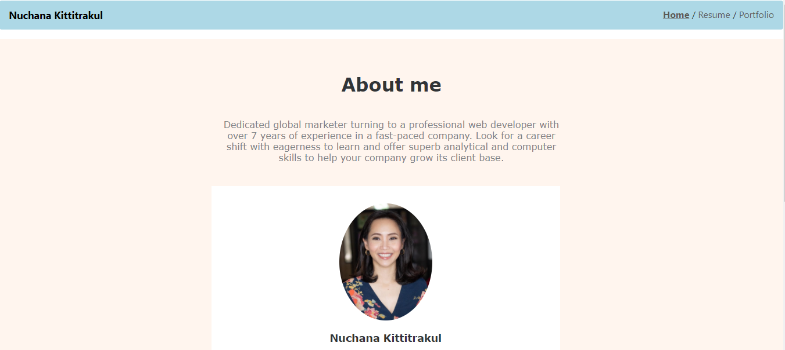

# Nuchana-react-portfolio

Serverless web portfolio that I created to show my profile, resume and projects. Created with React and Bootstrap 4, and bootstrapped using [Create React App](https://github.com/facebookincubator/create-react-app).

## Table of Contents

* [Installation](#installation)
* [Usage](#usage)
    * [Screenshots](#screenshots)
    * [Technologies](#Technologies)

## Installation

1. Clone repository. 
2. npm start.
3. Open http://localhost:3000 to view it in the browser.
4. The page will reload if you make edits. You will also see any lint errors in the console.

* [See Deployed Site](https://nuchana.github.io/Nuchana-react-portfolio/)

## Usage

### Screeshots

Homepage displaying employee directory

### Technologies used
* [React](https://reactjs.org/docs/getting-started.html)
* [React-DOM](https://reactjs.org/docs/react-dom.html)
* [HTML](https://developer.mozilla.org/en-US/docs/Web/HTML)
* [CSS](https://developer.mozilla.org/en-US/docs/Web/CSS)
* [Bootstrap](https://getbootstrap.com/)
* [Javascript](https://www.javascript.com/)

